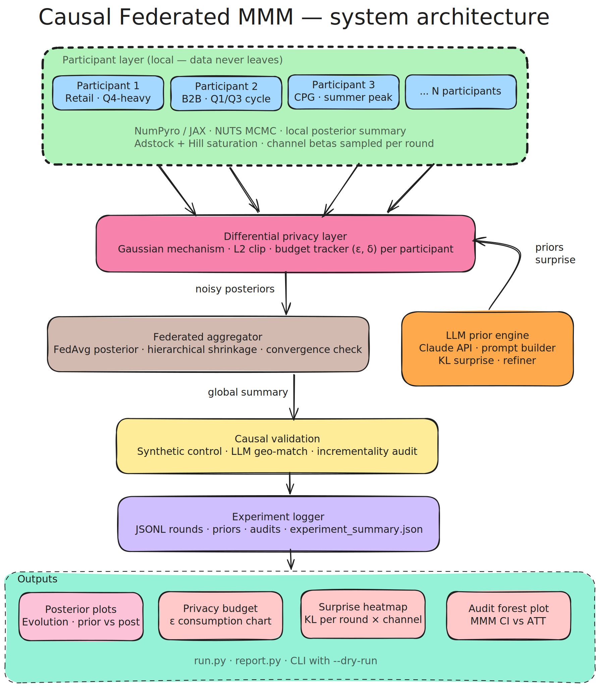

# Federated MMM

Research codebase for **federated media mix modeling (MMM)**: multiple participants train local Bayesian MMM-style models, an aggregator combines posteriors (FedAvg-style), **LLM-derived priors** guide each round, and **differential privacy** budgets limit what is shared. **Causal incrementality checks** (synthetic control) help validate channel effects against observational data.

Python **3.10+** is required.

<p align="center">
  
</p>

---

## Features

| Area | What lives here |
|------|-----------------|
| **Participants** | Local training, NumPyro/JAX MMM, Flower-compatible client hooks (`participants/`) |
| **Aggregator** | Federated loop, round manager, hierarchical and FedAvg-style posterior aggregation (`aggregator/`) |
| **LLM priors** | Prompt construction, elicitation, refinement, KL-based surprise (`llm_prior/`) |
| **Privacy** | Budget tracking, Gaussian mechanism, sensitivity, DP sharing (`privacy/`) |
| **Causal validation** | Geo loading, synthetic control fit, incrementality audit vs global summary (`causal_validation/`) |
| **Synthetic data** | Weekly participant CSVs for experiments (`data/synthetic/`) |
| **Visualization** | Posterior evolution, privacy budget, surprise heatmaps, audit forest plots (`visualization/`) |
| **Experiment logging** | JSONL rounds/priors/audits plus `experiment_summary.json` (`config/experiment_logger.py`) |

---

## Installation

From the repository root:

```bash
pip install -e .
```

For development tools (pytest, formatters):

```bash
pip install -e ".[dev]"
```
For exact reproducibility use:

```bash
pip install -r requirements-lock.txt
```

You will need API credentials where the stack calls external LLMs (see `llm_prior/` and your environment). JAX/Torch stacks can be large; install on a machine that matches your CUDA/CPU targets if you use GPU.

---

## Configuration

- **`config/global.yaml`** — Global knobs: participant count, rounds, channels, privacy block, LLM settings, seed. Can also hold **`incrementality_audit`** and **`visualization`** sections for the CLI (paths, audit artifacts, plot output directory).
- **`config/participant_*.yaml`** — Per-participant settings used by synthetic data generation (and can be aligned with federated configs in custom setups).

Training expects a YAML that includes a **`participants`** list with ids and channel descriptors (see `tests/smoke_test_aggregator_4_fedarated_loop_1.py` for a minimal shape). You can maintain a separate training config or extend the global file for your runs.

---

## Command-line tools

### `run.py` — pipeline

All subcommands except **`report`** require **`--config`** (path to YAML) and support **`--dry-run`** (print planned actions only).

```bash
python run.py generate-data --config config/global.yaml
python run.py train --config path/to/training.yaml
python run.py validate --config config/global.yaml
python run.py visualize --config config/global.yaml
```

- **`generate-data`** — Writes synthetic CSVs under `data/synthetic/` via `data/synthetic/run_generation.py` (participant configs from `config/`).
- **`train`** — Runs `run_federated_training`; round summaries are written under **`results/`** as `round_<n>.json`.
- **`validate`** — Loads `incrementality_audit` (or `audit`) from YAML: geo CSV, matched geos, channel, and `global_summary` from the chosen round in `results/`. Prints audit JSON.
- **`visualize`** — Reads `results/round_*.json`, builds plots under `plots/` by default (override in `visualization.output_dir`).

**Report** (no `--dry-run`; `--config` optional for budget display):

```bash
python run.py report path/to/experiment_folder --config config/global.yaml
```

`experiment_folder` is the `ExperimentLogger` base directory (contains `experiment_summary.json` and `logs/`).

### `report.py` — console report

Same output as `run.py report`:

```bash
python report.py path/to/experiment_folder [--config config/global.yaml]
```

Uses **Rich** (or **tabulate**, or plain text) for a table of per-round channel means, epsilon remaining (when a cap is known), convergence flag, audit coverage summary, plus incrementality audit lines and **LLM Prior Quality** (average surprise per round).

---

## Project layout (high level)

```
aggregator/          # Federated loop, rounds, Flower simulation hooks
causal_validation/   # Synthetic control + incrementality audit
config/              # YAML + experiment logger
data/synthetic/      # Generators and run_generation
llm_prior/           # LLM prior pipeline and surprise
participants/        # Local MMM, trainer, Flower client
privacy/             # DP budget and noise
tests/               # Smoke and integration-style scripts
visualization/       # Matplotlib plots
results/             # Example round JSON outputs (git may track or ignore)
run.py               # Main CLI
report.py            # Experiment reporting CLI
pyproject.toml       # Package metadata and dependencies
```

---

## Tests

Smoke tests are individual scripts under `tests/`. To run the bundled suite driver:

```bash
python tests/run_smoke_tests.py
```

Many tests mock LLMs or heavy inference; some exercise NumPyro/JAX paths or geo/causal utilities directly.

---

## Outputs

| Artifact | Typical location |
|----------|------------------|
| Synthetic CSVs | `data/synthetic/<participant_id>.csv` |
| Federated rounds | `results/round_<n>.json` |
| Experiment trace | `<exp_dir>/logs/rounds.jsonl`, `priors.jsonl`, `audits.jsonl` |
| Experiment summary | `<exp_dir>/experiment_summary.json` |
| Plots | `plots/` (or `visualization.output_dir`) |

---

## License and name

The PyPI-style project name in `pyproject.toml` is **fedarated_mmm** (spelling as in the package). Add a `LICENSE` file if you distribute the repo publicly.

---

## Contributing

Match existing module style, keep changes scoped, and extend smoke tests when you add behavior that should keep working in CI-style runs.

## Research Contributions

This codebase explores three underexplored intersections:

**1. LLM-in-the-loop Bayesian workflow**
Prior distributions are not hand-tuned but elicited from an LLM using
participant business context. KL surprise scores from each round feed
back into the next round's prompt, creating a closed feedback loop
between language model reasoning and Bayesian inference.

**2. Federated causal identification under privacy constraints**
Standard MMM assumes centralized data. This codebase explores what
causal channel attribution is recoverable when only DP-noised posterior
summaries are shared — and validates estimates against synthetic control
holdout experiments.

**3. Privacy-utility tradeoff on posterior summaries**
Rather than applying DP to gradients (as in standard DP-SGD), this
work applies the Gaussian mechanism to Bayesian posterior sufficient
statistics, with a hierarchical shrinkage aggregator designed to
partially compensate for noise-induced variance inflation.
